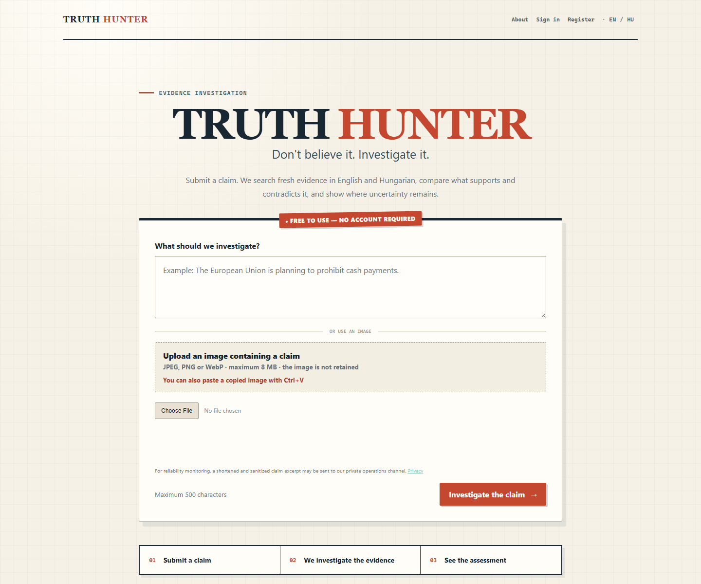
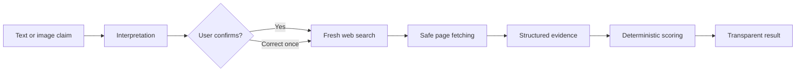

# Truth Hunter

**Don't believe it. Investigate it.**

Truth Hunter is a self-hosted evidence-investigation web application. A user
submits a claim as text or an image, confirms the proposition the system
understood, and receives a transparent assessment built from fresh web
evidence—not an unsupported AI answer.

[Live beta](https://truth.abathur.hu) · [Changelog](CHANGELOG.md) · [Product specification](TRUTH_HUNTER_SPEC.md) · [Security policy](SECURITY.md) · [Contributing](CONTRIBUTING.md)

## Try Truth Hunter online

**[Launch the public beta at truth.abathur.hu →](https://truth.abathur.hu/)**

No installation is required, and visitors can run an investigation without an
account. Truth Hunter is free during the public testing period; please inspect
the displayed evidence and use the feedback controls to help improve it.

> Early beta: Truth Hunter is designed to help people inspect evidence. It is
> not an oracle and should not replace qualified medical, legal, financial, or
> safety advice.



## Why this project exists

Most AI fact-checking demos ask a language model to produce a confident answer.
Truth Hunter takes a more accountable route: search first, retain the evidence,
score it with versioned application rules, show disagreements, and return
**Inconclusive** when the evidence is insufficient.

The application is free to use. Complete evidence details and source links are
available to users; optional voluntary support is deliberately separate from
product access.

## How an investigation works



1. **Understand the claim.** AI converts the submission into a clear factual
   proposition. The user confirms or corrects it before research begins.
2. **Find current evidence.** SearXNG is used first. The official Brave Search
   API is a bounded fallback only when the free route finds no useful evidence.
3. **Evaluate sources.** Relevant pages are fetched through an SSRF-aware,
   size-limited extractor and converted into structured supporting,
   contradicting, or neutral evidence.
4. **Calculate the assessment.** Versioned application code—not an unrestricted
   model response—calculates evidence balance, sufficiency, confidence, and the
   verdict.
5. **Show the work.** Results include concise reasoning, strongest arguments,
   conflicts, method metadata, bounded excerpts, and original source links.

## Highlights

- English and Hungarian interfaces and result generation
- Text, file-upload, and clipboard-image claim submission
- Local English/Hungarian Tesseract OCR; uploaded images are not retained
- Free-first AI routing through Groq and Gemini with bounded DeepSeek fallback
- SearXNG search with a metered, last-resort official Brave Search fallback
- Deterministic evidence weighting, sufficiency, confidence, and verdict rules
- Explicit conflict detection and evidence-first `INCONCLUSIVE` behavior
- Email verification, password reset, signed sessions, history, and deletion
- Private-by-default results with permanent optional public sharing
- Helpful/not-helpful feedback and a privacy-conscious operations dashboard
- Docker Compose deployment with FastAPI, PostgreSQL, SearXNG, and Caddy
- More than 100 automated unit, integration, and security tests

## Architecture

| Component | Responsibility |
| --- | --- |
| FastAPI + Jinja2 | Server-rendered application, sessions, forms, and APIs |
| PostgreSQL + SQLAlchemy | Users, investigations, sources, evidence, feedback, and provider telemetry |
| Alembic | Versioned database migrations |
| SearXNG | Primary self-hosted search abstraction |
| Brave Search API | Bounded fallback when free search yields no useful evidence |
| Groq + Gemini | Free-first structured AI operations |
| DeepSeek | Explicitly enabled and capped paid fallback |
| Tesseract + Pillow | Local, bounded OCR and safe raster-image decoding |
| Caddy | HTTPS, security headers, request limits, and reverse proxying |

Provider adapters are isolated behind application interfaces, so routing can
evolve without coupling the investigation pipeline to a single vendor.

## Security and privacy decisions

- `.env`, credentials, databases, and build artifacts are excluded from Git.
- Production rejects placeholder secrets and development email delivery.
- The application container runs as an unprivileged user.
- PostgreSQL and SearXNG do not publish host ports.
- Claims, model outputs, fetched pages, and uploaded files are treated as
  untrusted data.
- CSRF protection, secure signed cookies, trusted-host validation, security
  headers, password hashing, and authentication throttling are enabled.
- URL fetching blocks private/internal destinations, revalidates redirects,
  ignores environment proxies, and enforces time, size, redirect, and content
  limits.
- JPEG, PNG, and WebP uploads are verified by decoded content, bounded by bytes
  and pixels, and discarded after OCR.
- Provider attempt telemetry stores outcomes without API keys or source text.

Please report vulnerabilities according to [SECURITY.md](SECURITY.md).

## Run with Docker Compose

Requirements: Docker Desktop or Docker Engine with Docker Compose.

```powershell
Copy-Item .env.example .env
notepad .env
docker compose config
docker compose up --build -d
docker compose ps
Invoke-WebRequest http://localhost/health/live
Invoke-WebRequest http://localhost/health/ready
```

Use development placeholders only for local development. Replace every
`change-me` value and configure real provider credentials before production.
The application applies Alembic migrations before starting.

To inspect logs or stop the stack without deleting persistent data:

```powershell
docker compose logs --tail 200 truthhunter postgres caddy searxng
docker compose down
```

`docker compose down -v` deletes service volumes and should only be used when
the database is intentionally disposable.

## Native development

Python 3.10 or newer is supported.

```powershell
py -m venv .venv
.\.venv\Scripts\Activate.ps1
python -m pip install --upgrade pip
python -m pip install -e ".[dev]"
Copy-Item .env.example .env
uvicorn app.main:app --reload
```

The Compose `DATABASE_URL` uses the internal `postgres` service hostname. Set a
locally reachable PostgreSQL URL when running the application outside Compose.
Native OCR also requires a local Tesseract installation with English and
Hungarian language data; the Docker image includes both automatically.

## Quality checks

```powershell
python -m pytest
python -m ruff check .
python -m ruff format --check .
python -m mypy app tests
docker compose config --quiet
```

The migration integration test is opt-in because it upgrades its configured
database. Point `TEST_DATABASE_URL` to a disposable PostgreSQL database before
running `python -m pytest -m database`.

## Health endpoints

- `GET /health/live` checks only the application process.
- `GET /health/ready` checks PostgreSQL readiness and returns a sanitized `503`
  response when the database is unavailable.

## Current limitations

- Search engines and source websites may rate-limit or block automated access.
- The service currently investigates written claims, not video, audio, faces,
  image authenticity, or general visual content.
- AI can misunderstand ambiguous wording or source material; users should
  inspect the original evidence.
- The beta is operated on a small self-hosted deployment and uses fair-use
  safeguards rather than a paid entitlement system.

## Roadmap

Near-term work focuses on evidence quality, source deduplication, abuse
protection, operational trend snapshots, backup/restore verification, and
continued private/public beta evaluation. Integrated subscriptions and credit
sales are intentionally deferred; voluntary support may be linked externally
without storing financial information or granting product benefits.

## License

Released under the [MIT License](LICENSE).
